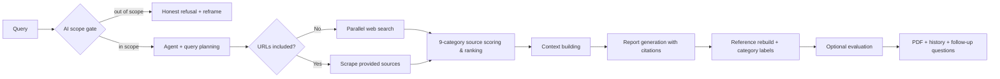

<h1 align="center">ATLAS</h1>

<p align="center">
  <strong>Open-source AI intelligence & verified research platform</strong>
</p>

<p align="center">
  Ask about the AI landscape. Get a report where every source is quality-scored,
  every reference URL was actually read, and every day starts with an automated
  intelligence briefing in your inbox.
</p>

<p align="center">
  
  
  
  
  
</p>

ATLAS is a self-hosted research assistant focused on one domain: **AI** — models,
papers, tooling, infrastructure, agents, benchmarks. It is built for engineers and
researchers who need answers they can verify, not just answers.

## Why ATLAS over another chat tab

Closed tools can't show you why you should trust them. ATLAS makes the trust
mechanics inspectable:

- **Transparent source scoring** — every URL is classified into a fixed 9-category
  taxonomy (peer-reviewed → official docs → arXiv → … → low-quality) with a 0–100
  score by deterministic, unit-tested rules. No LLM judgment, no black box.
  Low-quality sources are never primary evidence.
- **Citations that can't be fabricated** — the model only emits `[N]` markers; the
  reference list is rebuilt by the system from URLs it actually scraped. Category
  labels appear next to every reference.
- **Honest refusals** — non-AI questions get a clear "out of scope" answer with a
  suggested AI-angle reframe, instead of a confident off-domain hallucination.
- **Daily AI intelligence automation** — a scheduler runs a deep research pass over
  your topics every morning and emails the report (SMTP, with a mock mode for dev).
- **Measured, not vibes** — an online LLM-judge evaluation harness (RAGAS-based
  RAG triad, citation coverage, refusal accuracy) scores every run via
  `run_eval.py` or `/api/evaluation/*`.

## The three research modes

| Mode | What it does |
| --- | --- |
| **Quick Answer** (`quick`) | Fast, cited answer to a direct question |
| **Research** (`research`) | Structured report grounded in papers & official sources |
| **Deep Research** (`deep`) | Multi-step analysis with impact assessment and confidence levels; paste URLs to deep-dive specific sources |

## Workflow



## Quick start

```bash
git clone https://github.com/phamvanhoang9/atlas.git && cd atlas
python -m venv .venv
# Windows: .\.venv\Scripts\Activate.ps1   |   macOS/Linux: source .venv/bin/activate
pip install -r requirements.txt
cp .env.example .env          # set OPENAI_API_KEY and TAVILY_API_KEY
cp config.json.example config.json
python main.py
```

Open http://127.0.0.1:8000 — the app has three views:

- **Research** — query + mode picker, live progress, streamed report, ranked
  sources panel with category chips and scores, follow-up questions, PDF export.
- **Automation** — daily report schedule (time, timezone, email, topics, depth),
  manual "Run now", and run history with delivery status.
- **History** — every chat report and daily intelligence report, filterable and
  searchable.

## Daily AI intelligence

Configure once in the **Automation** view (or via REST):

```text
GET/PUT /api/automation/config       # enabled, time, timezone, email, topics, depth
POST    /api/automation/run          # run now
GET     /api/automation/runs         # run history with status + email delivery
GET     /api/automation/runs/{id}    # single run detail
```

Email is sent via SMTP (`SMTP_*` env vars); without credentials ATLAS uses a
**mock mode** that logs the email and records `email_status="mocked"` — clearly
shown in the UI. The scheduler runs in-process on a tick loop, so run **only one
replica** — a second instance would race to send the same daily email.

## Configuration

Precedence: env-var defaults → `config.json` → per-mode overrides at runtime.

| Variable | Purpose |
| --- | --- |
| `OPENAI_API_KEY` | Required — default LLM + embeddings |
| `TAVILY_API_KEY` | Required for real web search |
| `ATLAS_AUTH_TOKEN` | Bearer/query token auth for REST + WS; unset = open (local dev only) |
| `LLM_PROVIDER` / `LLM_MODEL` | `openai` (default `gpt-4o-mini`; deep mode auto-upgrades) or `google` |
| `ENABLE_EVALUATION` | Run the in-workflow evaluation step |
| `EMAIL_MODE`, `SMTP_*` | Daily-report email delivery (mock fallback) |
| `HISTORY_DB_PATH`, `ATLAS_CACHE_DB` | SQLite locations |
| `ENABLE_SEARCH_CACHE`, `ENABLE_EMBEDDING_CACHE` | Cost-control caches |
| `ENABLE_CROSS_ENCODER_RERANKING` | Local reranker for context compression |

Full annotated list in [.env.example](.env.example).

## API surface

| Route | Purpose |
| --- | --- |
| `GET /` | App shell |
| `GET /health` | Health check |
| `WS /ws` | Research job + streaming (`logs`, `sources`, `report`, `refusal`, `quality_check`, `suggested_questions`, `evaluation`, `path`) |
| `GET/DELETE /api/history…` | History list/entry/search/export/stats/clear |
| `GET/PUT/POST /api/automation/…` | Automation config, manual run, run history |
| `POST/GET /api/evaluation/…` | Run/fetch a RAGAS evaluation for a query or a stored history entry |

WS request: `start {"task": "...", "report_type": "quick|research|deep"}`.
Auth (when enabled): `Authorization: Bearer <token>` or `?token=<token>`.

## Tests and evaluation

```bash
python -m pytest                  # full suite (165 tests)
ruff check src tests main.py      # lint
python run_eval.py quick          # full online pipeline + LLM-judge (RAGAS) evaluation
python run_eval.py --all          # benchmark all 3 modes
```

The evaluation logic itself lives in `src/quality/evaluation/` (RAGAS adapter,
retrieval/generation/refusal metrics) and is exercised both by `run_eval.py`
and the `/api/evaluation/*` REST routes — see the API surface table above.

## Docker

```bash
docker compose up -d --build                          # development
docker compose -f docker-compose.prod.yml up -d --build   # production (localhost-bound; put TLS proxy in front)
```

The production compose file binds to localhost only — put a TLS-terminating
reverse proxy in front before exposing it publicly. Run a single container
instance (see the scheduler note above).

## Development

```bash
python -m compileall -q src main.py
ruff check src tests main.py
python -m pytest
```

Contributor conventions: API routes in `src/api`, workflow in `src/orchestration`,
node behavior in `src/agents`, modes in `src/modes`, prompts in YAML under
`src/prompts/templates` (never hard-coded), source quality in `src/quality`,
automation in `src/automation`. Add tests for behavior changes; never commit
`.env`, `.atlas_data/`, `.atlas_cache/`, or `outputs/`.

## Acknowledgements

Originally inspired by [GPT Researcher](https://github.com/assafelovic/gpt-researcher).
ATLAS diverges with an AI-domain scope gate, a deterministic source-quality system,
rebuilt verifiable citations, daily intelligence automation, and an evaluation
harness.

## License

MIT License. See `LICENSE` for details.
