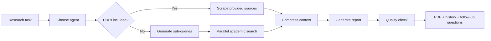

<h1 align="center">ATLAS</h1>

<p align="center">
  <strong>Agentic Task & Literature Analysis System</strong>
</p>

<p align="center">
  Turn a messy research question into searched sources, compressed context, a grounded report, a PDF, and searchable history.
</p>

<p align="center">
  
  
  
  
  
</p>

ATLAS is a FastAPI-based research assistant for AI researchers and engineers. It plans research with LangGraph, searches academic sources, scrapes and compresses evidence, writes reports with citations, exports results, and keeps a searchable research history.

The project is built for the Vietnamese AI research community, with Vietnamese UI labels and report workflows, while the codebase can be adapted for other research teams and languages.

## Why ATLAS

Most research assistants stop at chat. ATLAS is built as a workflow:

- It decomposes a task into focused academic search queries.
- It favors papers, proceedings, publishers, and research labs over low-signal sources.
- It compresses retrieved context before generation instead of dumping raw search results into the model.
- It validates generated reports against collected source URLs.
- It saves reports, suggested follow-up questions, PDFs, and history for later review.

## Workflow



## Highlights

| Area | What ATLAS does |
| --- | --- |
| Orchestration | LangGraph nodes for agent selection, query generation, search, context processing, and report generation. |
| Research modes | Q&A (`hỏi đáp`), paper recommendations (`đề xuất bài báo`), and deep analysis (`phân tích`). |
| Academic retrieval | Tavily search with DuckDuckGo fallback and academic domain filters. |
| Source handling | Direct URL extraction, web/PDF scraping, context compression, and source-aware report structure. |
| Performance | Parallel multi-query search, SQLite search cache, SQLite embedding cache, and optional cross-encoder reranking. |
| Product surface | Web UI, WebSocket streaming, history sidebar, suggested questions, copy support, and PDF export. |
| Deployment | Local Uvicorn, Docker, production Compose, SQLite persistence, and optional bearer-token auth. |

## Project Layout

```text
ATLAS/
|-- frontend/              # Jinja-served web UI assets
|-- src/api/               # FastAPI app, routes, auth, shared dependencies
|-- src/agents/            # LangGraph node implementations
|-- src/orchestration/     # Workflow, routers, state, runner
|-- src/prompts/           # YAML prompt templates and prompt registry
|-- src/rag/               # Chunking, retrieval, embeddings, reranking
|-- src/retrievers/        # Search providers
|-- src/scraping/          # Web/PDF extraction helpers
|-- src/storage/           # SQLite history and TTL cache
|-- src/quality/           # Report validation
|-- tests/                 # Unit and integration tests
|-- docs/                  # Agent memory and project guidance
|-- outputs/               # Generated Markdown/PDF reports
|-- main.py                # Local app entry point
`-- pyproject.toml         # Project metadata and tool config
```

## Prerequisites

- Python 3.12 is recommended. The package metadata allows Python 3.10+, but CI and Docker use Python 3.12.
- OpenAI API key for the default LLM and embedding provider.
- Tavily API key for web search.
- Optional Gemini API key if you switch `LLM_PROVIDER=google`.
- Optional Docker or Docker Desktop for containerized runs.

## Quick Start

1. Clone the repository and enter the project directory.

   ```bash
   git clone <your-repo-url>
   cd ATLAS
   ```

2. Create and activate a virtual environment.

   ```bash
   python -m venv .venv
   ```

   Windows PowerShell:

   ```powershell
   .\.venv\Scripts\Activate.ps1
   ```

   macOS/Linux:

   ```bash
   source .venv/bin/activate
   ```

3. Install dependencies.

   ```bash
   python -m pip install --upgrade pip
   pip install -r requirements.txt
   ```

4. Create your environment file.

   Windows PowerShell:

   ```powershell
   Copy-Item .env.example .env
   ```

   macOS/Linux:

   ```bash
   cp .env.example .env
   ```

   Edit `.env` and set at least:

   ```env
   OPENAI_API_KEY=your_openai_key
   TAVILY_API_KEY=your_tavily_key
   ```

5. Create a local runtime config.

   ```bash
   cp config.json.example config.json
   ```

   On Windows PowerShell:

   ```powershell
   Copy-Item config.json.example config.json
   ```

   The current web research runner passes `config.json` explicitly when starting a job, so create this file before submitting tasks.

6. Start the app.

   ```bash
   python main.py
   ```

   Or run Uvicorn directly:

   ```bash
   python -m uvicorn src.api.server:app --reload
   ```

7. Open the web UI.

   ```text
   http://127.0.0.1:8000
   ```

## Configuration

ATLAS initializes config fields from environment variables, then loads `config.json`, and finally applies mode-specific overrides for each research mode. For overlapping config fields, the current `config.json` values override matching environment variables.

Common environment variables:

| Variable | Purpose |
| --- | --- |
| `OPENAI_API_KEY` | Required for default OpenAI LLM and embeddings. |
| `TAVILY_API_KEY` | Required for Tavily search. |
| `GEMINI_API_KEY` | Required when `LLM_PROVIDER=google`. |
| `LLM_PROVIDER` | `openai` or `google`. Defaults to `openai`. |
| `LLM_MODEL` | Chat model name. Defaults to `gpt-4o-mini`. |
| `EMBEDDING_PROVIDER` | `openai` or `huggingface`. Defaults to `openai`. |
| `ATLAS_AUTH_TOKEN` | Enables bearer-token auth for REST and WebSocket routes when set. |
| `CORS_ORIGINS` | Comma-separated allowed origins. Defaults to local app origins. |
| `REQUIRE_API_KEYS` | Set `true` in production to fail fast when required keys are missing. |
| `HISTORY_DB_PATH` | SQLite history path. Defaults to `.atlas_data/history.sqlite`. |
| `ATLAS_CACHE_DB` | SQLite cache path. Defaults to `.atlas_cache/cache.sqlite`. |
| `ENABLE_SEARCH_CACHE` | Enables cached search results. Defaults to `true` at runtime. |
| `ENABLE_EMBEDDING_CACHE` | Enables cached embeddings. Defaults to `true` at runtime. |
| `ENABLE_CROSS_ENCODER_RERANKING` | Enables local cross-encoder reranking when dependencies/model are available. |
| `ENABLE_PARALLEL_SEARCH` | Enables parallel search for multi-query modes. Defaults to `true`. |
| `ATLAS_LOG_LEVEL` | Logging level for ATLAS modules. Defaults to `INFO`. |

Runtime configuration values such as token limits, chunking, similarity threshold, report format, max search results, and total report words can be set in `config.json` or through matching environment variables. Use `config.json.example` as the starting point.

## Research Modes

| Mode value | UI label | Behavior |
| --- | --- | --- |
| `hỏi đáp` | Hỏi đáp | Fast Q&A. Generates one extra search query plus the original query, uses fewer results, and targets shorter answers. |
| `đề xuất bài báo` | Đề xuất bài báo | Paper recommendation mode. Generates a broader set of academic queries and produces a longer reading list. |
| `phân tích` | Phân tích | Deep analysis mode. With URLs, analyzes the provided source or paper directly. Without URLs, performs topic analysis across multiple sources. |

The app automatically extracts URLs from the task text. If URLs are present, the workflow skips query generation and scrapes the provided sources directly.

## Example Prompts

Use these as starting points:

| Goal | Mode | Prompt |
| --- | --- | --- |
| Quick technical answer | `hỏi đáp` | `What is speculative decoding, and when does it help LLM serving?` |
| Reading list | `đề xuất bài báo` | `Recommend recent papers on agentic RAG systems with code or benchmarks.` |
| Topic deep dive | `phân tích` | `Compare GraphRAG, RAPTOR, and standard vector RAG for long-context QA.` |
| Paper/source analysis | `phân tích` | `Analyze this paper and explain the implementation details: https://arxiv.org/abs/...` |

## Usage

### Web UI

1. Enter a research question, topic, or prompt with URLs.
2. Choose a research mode.
3. Submit the task and watch progress stream in real time.
4. Review the generated report, quality check, suggested follow-up questions, and exported PDF/Markdown file.
5. Use the history sidebar to search, reopen, export, or delete previous runs.

Generated files are written to `outputs/`. Research history is stored in SQLite under `.atlas_data/` by default.

### WebSocket API

Connect to:

```text
ws://127.0.0.1:8000/ws
```

Send a message with the `start ` prefix:

```text
start {"task": "Compare LoRA and adapter tuning", "report_type": "phân tích"}
```

The server streams JSON messages such as:

- `history_id`: ID of the created history entry.
- `logs`: progress updates.
- `report`: report content streamed from the LLM.
- `quality_check`: report validation metadata.
- `suggested_questions`: follow-up questions.
- `path`: generated PDF or Markdown path.

When `ATLAS_AUTH_TOKEN` is set, pass the token as either `Authorization: Bearer <token>` or `?token=<token>`.

### History REST API

History endpoints are mounted under `/api/history`:

```text
GET    /api/history
GET    /api/history?limit=10
GET    /api/history/stats
GET    /api/history/search/{search_term}
GET    /api/history/{entry_id}
GET    /api/history/export
DELETE /api/history/{entry_id}
DELETE /api/history
```

These routes use the same optional bearer-token auth as the WebSocket route.

## Docker

For local Docker Compose:

```bash
docker compose up -d --build
```

For production-style Compose:

```bash
docker compose -f docker-compose.prod.yml up -d --build
```

The production compose file:

- binds the app to `127.0.0.1:8000`,
- enables required API-key validation,
- stores history in `.atlas_data/`,
- stores cache data in `.atlas_cache/`,
- enables search and embedding caches,
- enables cross-encoder reranking,
- persists generated reports in `outputs/`.

If your Docker installation uses the legacy command, replace `docker compose` with `docker-compose`.

## Releases

Stable versions are available from the repository's GitHub Releases page. Releases are created from Git tags such as `v1.0.0`, and GitHub provides source code archives for each release.

ATLAS requires users to provide their own API keys in a local `.env` file copied from `.env.example`. Never commit real API keys, `.env` files, local `config.json` files, credentials, caches, SQLite databases, or generated reports.

## Development

Install the same dependencies used in CI:

```bash
pip install -r requirements.txt
```

Run the checks:

```bash
python -m compileall -q src main.py
ruff check src tests main.py
python -m pytest
```

Useful local test settings:

```env
ENABLE_SEARCH_CACHE=false
ENABLE_EMBEDDING_CACHE=false
ENABLE_CROSS_ENCODER_RERANKING=false
```

Most tests mock external providers, but setting placeholder API keys can make local runs match CI:

```env
OPENAI_API_KEY=test-openai-key
TAVILY_API_KEY=test-tavily-key
GEMINI_API_KEY=test-gemini-key
```

## Contributor Notes

- Keep changes aligned with the existing module boundaries: API routes in `src/api`, workflow logic in `src/orchestration`, node behavior in `src/agents`, prompts in `src/prompts/templates`, and storage concerns in `src/storage`.
- Prefer adding focused tests in `tests/` for workflow routing, config behavior, provider wrappers, storage, and report validation changes.
- Prompt changes should be made in YAML templates and covered by prompt registry tests when behavior changes.
- Avoid committing generated runtime data from `.atlas_cache/`, `.atlas_data/`, or `outputs/`.
- Run `ruff check src tests main.py` and `python -m pytest` before opening a pull request.

## Further Reading

- `AGENTS.md` for repository guidance used by coding agents.
- `RELEASE.md` for tag-driven release steps and release safety checks.
- `docs/agent-memory/PROJECT_STATE.md` for the current project state.
- `docs/agent-memory/DECISIONS.md` for durable architecture and process decisions.
- `docs/agent-memory/NEXT_STEPS.md` for open follow-up work.
- `docs/agent-memory/TASK_LOG.md` for recent agent work summaries.

## Troubleshooting

- Missing `TAVILY_API_KEY`: search cannot start unless Tavily is configured. The retriever can fall back to DuckDuckGo only after Tavily is initialized.
- Missing `OPENAI_API_KEY`: default LLM and embeddings will fail. Set `LLM_PROVIDER=google` only when Gemini is configured.
- Port already in use: run Uvicorn with another port, for example `python -m uvicorn src.api.server:app --reload --port 8001`.
- Unauthorized API/WebSocket response: remove `ATLAS_AUTH_TOKEN` for local development or pass the configured token.
- PDF export fallback: if PyMuPDF cannot render a PDF, ATLAS returns the generated Markdown path instead.

## Acknowledgements

The initial idea was inspired by [GPT Researcher](https://github.com/assafelovic/gpt-researcher). ATLAS builds on that general direction with a LangGraph-based workflow, Vietnamese research-oriented UI, mode-specific report behavior, academic source filtering, history storage, and PDF export.

## License

MIT License. See `LICENSE` for details.
