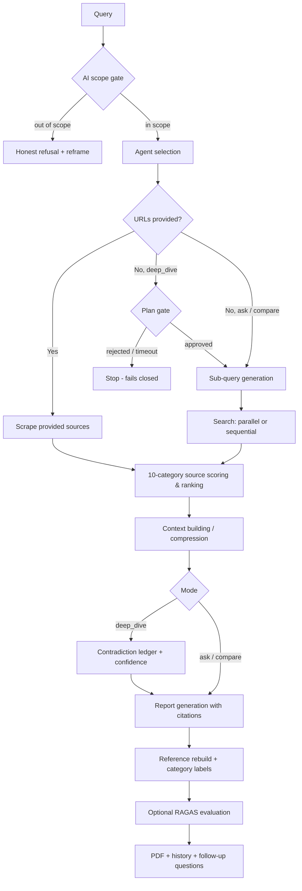

<h1 align="center">ATLAS</h1>

<p align="center">
  <strong>Open-source AI intelligence & verified research platform</strong>
</p>

<p align="center">
  Ask about the AI landscape. Get a report where every source is quality-scored,
  every reference URL was actually read, and recurring watches deliver an
  intelligence digest to your inbox on a schedule you set.
</p>

<p align="center">
  
  
  
  
  
</p>

ATLAS is a self-hosted research assistant focused on one domain: **AI** — models,
papers, tooling, infrastructure, agents, benchmarks. It is built for engineers and
researchers who need answers they can verify, not just answers.

## Why ATLAS over another chat tab

Closed tools can't show you why you should trust them. ATLAS makes the trust
mechanics inspectable:

- **Transparent source scoring** — every URL is classified into a fixed 10-category
  taxonomy (official docs → peer-reviewed → arXiv → … → low-quality) with a 0–100
  score by deterministic, unit-tested rules. No LLM judgment, no black box.
  Low-quality sources are never primary evidence.
- **Citations that can't be fabricated** — the model only emits `[N]` markers; the
  reference list is rebuilt by the system from URLs it actually scraped. Category
  labels appear next to every reference.
- **You approve the plan before it spends** — Deep Dive pauses and shows you its
  research plan over the WebSocket. Reject it, edit it, or let it time out; the
  workflow fails closed and never proceeds unapproved.
- **Contradictions surfaced, not smoothed over** — Deep Dive emits a Contradiction
  Ledger and a Confidence Level computed deterministically from the scored-source
  distribution, so the confidence number is not the model's opinion of itself.
- **Honest refusals** — out-of-scope questions get a clear refusal with a suggested
  AI-angle reframe, instead of a confident off-domain hallucination. The default
  `ai_native` gate is deliberately soft (it serves what an AI builder actually
  asks); `ai_strict` hard-blocks anything where AI isn't the central subject.
- **Recurring intelligence** — Radar watches re-run your topics daily or weekly and
  email a digest whose "what's new" is exact set membership over deduped, scored
  source URLs, never an LLM's guess at what changed.
- **Measured, not vibes** — an LLM-judge evaluation harness (RAGAS-based RAG triad,
  citation coverage, refusal accuracy) scores runs via `run_eval.py`,
  `run_benchmark.py`, or `/api/evaluation/*`.

## The three research modes

Canonical mode ids are `ask`, `compare`, and `deep_dive`. They are the stable
technical contract across prompts, model routing, config profiles, and context
sizing — an unrecognized mode string falls back to `compare`.

| Mode | Id | What it does |
| --- | --- | --- |
| **Ask** | `ask` | Fast, cited answer to a direct question. 1 iteration, small context, forced to the cheap/fast model tier so it is genuinely cheap and not merely "not deep". |
| **Compare** | `compare` | Structured decision matrix. Search is domain-restricted to academic and primary sources (arXiv, OpenReview, ACL, NeurIPS, lab docs), up to 24 scraped URLs. |
| **Deep Dive** | `deep_dive` | Multi-step analysis with a user-approved research plan, impact assessment, contradiction ledger, and confidence level. Forced to the strongest configured model. Paste URLs to deep-dive specific sources. |

## Workflow



State lives in `src/orchestration/state.py`; the graph is assembled in
`src/orchestration/workflow.py` and routed by `src/orchestration/router.py`.

## Quick start

```bash
git clone https://github.com/phamvanhoang9/atlas.git && cd atlas
python -m venv .venv
# Windows: .\.venv\Scripts\Activate.ps1   |   macOS/Linux: source .venv/bin/activate
pip install -r requirements.txt
cp .env.example .env          # set OPENAI_API_KEY and TAVILY_API_KEY
cp config.json.example config.json
python main.py
```

Open http://127.0.0.1:8000 — the app has three views:

- **Research** — query + mode picker, live progress, Deep Dive plan approval,
  streamed report, ranked sources panel with category chips and scores,
  highlight any passage to get a plain-language explanation, follow-up
  questions, PDF export.
- **Automation** — the legacy daily report (time, timezone, email, topics, depth)
  plus **Radar** watch management, both with manual "Run now" and run history.
- **History** — every chat report and scheduled report, filterable and searchable.

The interface is bilingual (English default, Vietnamese toggle, persisted in
`frontend/i18n.js`). Report output language is auto-detected from the query
independently of the UI language.

## Radar

A **watch** is a saved recurring research job: topics, an underlying mode, a
daily or weekly cadence with timezone, a recipient, and preferred source
categories. Radar runs due watches sequentially and emails each digest.

```text
POST   /api/radar/watches               # create
GET    /api/radar/watches               # list
GET    /api/radar/watches/{id}          # single watch
PUT    /api/radar/watches/{id}          # update
DELETE /api/radar/watches/{id}          # delete
POST   /api/radar/watches/{id}/run      # run now
GET    /api/radar/watches/{id}/runs     # run history
GET    /api/radar/presets               # starter watches (arXiv daily, releases, OSS weekly)
GET    /api/radar/status                # quota usage
```

The digest body is assembled **deterministically** from the scored, URL-deduped
source list captured from the research run — so "what's new" is exact set
membership rather than model prose. `RADAR_DAILY_QUOTA` (default 20) caps total
watch-runs per day across all watches combined.

Radar is layered alongside the older single-config daily report rather than
replacing it; both schedulers run concurrently.

## Daily report (legacy scheduler)

```text
GET/PUT /api/automation/config       # enabled, time, timezone, email, topics, depth
POST    /api/automation/run          # run now
GET     /api/automation/runs         # run history with status + email delivery
GET     /api/automation/runs/{id}    # single run detail
```

Email is sent via SMTP (`SMTP_*` env vars); without credentials ATLAS uses a
**mock mode** that logs the email and records `email_status="mocked"` — clearly
shown in the UI. Both schedulers run in-process on a tick loop with SQLite-backed
idempotency, so run **only one replica** — a second instance would race to send
the same email.

## Configuration

Precedence: env-var defaults → `config.json` → per-mode overrides applied at
runtime by `Config.apply_mode_config()`.

| Variable | Purpose |
| --- | --- |
| `OPENAI_API_KEY` | Required — default LLM + embeddings |
| `TAVILY_API_KEY` | Required for real web search |
| `ATLAS_AUTH_TOKEN` | Bearer/query token auth for REST + WS; unset = open (local dev only) |
| `LLM_PROVIDER` / `LLM_MODEL` | `openai` (default `gpt-4o-mini`) or `google`; `ask` and `deep_dive` re-tier automatically |
| `ENABLE_EVALUATION` | Run the in-workflow evaluation step |
| `EMAIL_MODE`, `SMTP_*` | Email delivery for daily reports and Radar digests (mock fallback) |
| `RADAR_DAILY_QUOTA` | Max watch-runs per day across all watches (default 20) |
| `HISTORY_DB_PATH`, `ATLAS_CACHE_DB` | SQLite locations |
| `ENABLE_SEARCH_CACHE`, `ENABLE_EMBEDDING_CACHE` | Cost-control caches |
| `ENABLE_CROSS_ENCODER_RERANKING` | Local reranker for context compression |
| `SCOPE_MODE` | Scope gate strictness: `ai_native` (default, soft) or `ai_strict` (hard block) |

Full annotated list in [.env.example](.env.example).

## API surface

| Route | Purpose |
| --- | --- |
| `GET /` | App shell |
| `GET /health` | Health check |
| `WS /ws` | Research job + streaming |
| `GET/DELETE /api/history…` | History list/entry/search/export/stats/bulk delete |
| `GET/PUT/POST /api/automation/…` | Daily-report config, manual run, run history |
| `GET/POST/PUT/DELETE /api/radar/…` | Watch CRUD, run now, run history, presets, quota status |
| `POST /api/explain` | Explain a highlighted report passage in plain language (fast tier, outside LangGraph) |
| `POST/GET /api/evaluation/…` | Run/fetch a RAGAS evaluation for a query or a stored history entry |

Auth (when enabled): `Authorization: Bearer <token>` or `?token=<token>`.

### WebSocket protocol

Client sends `start` followed by JSON:

```json
{"task": "...", "report_type": "ask | compare | deep_dive"}
```

Server pushes typed messages: `logs`, `plan_proposal`, `sources`, `report`,
`refusal`, `quality_check`, `suggested_questions`, `evaluation`, `history_id`,
`path`, `error`.

For Deep Dive, the client answers a `plan_proposal` with
`plan_response <json>` carrying the matching `run_id`. No response, a
disconnect, or a rejection ends the run — the gate never defaults to approve.

## Tests and evaluation

```bash
python -m pytest                  # full suite (356 tests)
node --test tests/frontend/       # frontend logic tests (no npm install needed)
ruff check src tests main.py      # lint
python run_eval.py ask            # full online pipeline + LLM-judge (RAGAS) evaluation
python run_eval.py --all          # benchmark all 3 modes
python run_benchmark.py           # offline, deterministic benchmark
```

`run_eval.py` hits real APIs and forces evaluation on regardless of
`ENABLE_EVALUATION`. The evaluation logic lives in `src/quality/evaluation/`
(RAGAS adapter, retrieval/generation/refusal metrics) and is shared with the
`/api/evaluation/*` routes.

## Security

CI runs a Semgrep + Gitleaks + pip-audit aggregator
(`scripts/security/security_gate.py`) plus a Checkov infra scan on every push to
`main` and `dev`. The gate fails on any critical finding, any leaked secret, or a
security score below 90. Accepted-risk CVEs are tracked inline in the gate script
with rationale. There are no local git hooks — the gate runs only in CI.

## Docker

```bash
docker compose up -d --build                              # development
docker compose -f docker-compose.prod.yml up -d --build   # production
```

The production compose file binds to localhost only — put a TLS-terminating
reverse proxy in front before exposing it publicly. Run a single container
instance (see the scheduler note above).

## Development

```bash
python -m compileall -q src main.py
ruff check src tests main.py
python -m pytest
```

Contributor conventions: API routes in `src/api`, workflow in `src/orchestration`,
node behavior in `src/agents`, mode contracts in `src/modes`, prompts as YAML
under `src/prompts/templates` (never hard-coded — render via
`src/prompts/registry.py`), source quality in `src/quality`, schedulers and Radar
in `src/automation`, one-shot UI actions in `src/actions`. Add tests for behavior
changes; never commit `.env`, `.atlas_data/`, `.atlas_cache/`, or `outputs/`.

## Acknowledgements

Originally inspired by [GPT Researcher](https://github.com/assafelovic/gpt-researcher) — the first open deep research agent designed for both web and local research on any given task. ATLAS diverges with an AI-domain scope gate, a deterministic source-quality system, rebuilt verifiable citations, an approval-gated deep research mode, recurring Radar digests, and an evaluation harness.

## License

MIT License. See `LICENSE` for details.
